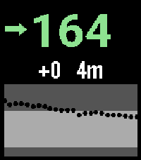

# PebbleXDrip

A Pebble quick-launch app that shows your xDrip+ CGM data — number, trend,
delta and a 2-hour graph. It is **not** a watchface, so you can run any
watchface and still get a glucose glance on demand.



## Install

Download the `.pbw` from [Releases](../../releases) and open it with the
Pebble app, or:

    pebble install --phone <phone-ip> pebblexdrip-1.0.0.pbw

Then:

1. **xDrip+** → Settings → Inter-app settings → enable **xDrip Web Service**.
2. **Pebble app** → your watch → Quick Launch → bind a button to
   **xDrip CGM**. Long-press it from any watchface to open the app.

## How it works

```
xDrip+  --local web server-->  PebbleKit JS (phone)  --AppMessage-->  app
        http://127.0.0.1:17580/sgv.json
```

The phone JS polls xDrip+'s local Nightscout-style endpoint and sends the
reading to the watch. The app refreshes on launch, on SELECT, and once a
minute while open.

xDrip+'s own glucose notification still mirrors to the watch under any
watchface, so that covers passive glances.

## Display

- **Number** — mg/dL. Green in range, red low, yellow high, grey when stale.
- **Arrow** — xDrip trend.
- **Line** — signed delta and minutes since the reading.
- **Graph** — last ~2 h. The lighter band is the 70–180 target range.

## Build from source

    cd pebblexdrip
    pebble build
    pebble install --phone <phone-ip>

Targets: basalt, chalk, diorite. Units: mg/dL.
